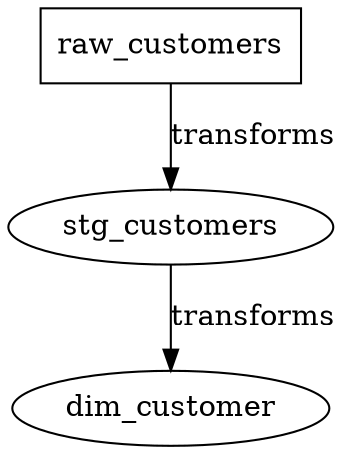

# DataTrace CLI Contract

**Version**: v1.0.0 | **Status**: Draft | **Last Updated**: 2026-06-30

## Overview

The DataTrace Command-Line Interface (CLI) provides terminal-based operations for metadata discovery, lineage tracking, and data asset management. The CLI is designed for data engineers, DevOps engineers, and automation scripts.

### Installation

```bash
# Install via pip
pip install datatrace

# Or use the Docker image
docker pull ghcr.io/datatrace/datatrace:latest
```

### Usage

```bash
# Show help
datatrace --help

# Show version
datatrace --version

# Use a command
datatrace <command> [options] [arguments]
```

## Global Options

| Option | Description | Required | Default |
|--------|-------------|----------|---------|
| `--config` | Path to configuration file | No | `~/.datatrace/config.yaml` |
| `--profile` | Profile name | No | `default` |
| `--verbose` | Verbose output | No | `false` |
| `--debug` | Debug mode (very verbose) | No | `false` |
| `--log-level` | Log level | No | `INFO` |
| `--log-file` | Log file path | No | `stderr` |

## Commands

### configure

**Description**: Configure DataTrace connections and settings

**Usage**:
```bash
datatrace configure [options]
```

**Subcommands**:

#### `configure init`

Initialize a new configuration file.

```bash
datatrace configure init [--output PATH]
```

**Options**:
- `--output, -o`: Output file path (default: `~/.datatrace/config.yaml`)

**Example**:
```bash
datatrace configure init --output /etc/datatrace/config.yaml
```

#### `configure add-connection`

Add a new connection configuration.

```bash
datatrace configure add-connection --name NAME --type TYPE [options]
```

**Options**:
- `--name, -n`: Connection name (required)
- `--type, -t`: Connection type: `bigquery`, `dbt`, `powerbi` (required)
- `--project`: GCP project ID (for BigQuery)
- `--dataset`: Default dataset (for BigQuery)
- `--dbt-path`: Path to dbt project (for dbt)
- `--workspace`: Power BI workspace ID (for Power BI)
- `--client-id`: Azure client ID (for Power BI)
- `--client-secret`: Azure client secret (for Power BI)
- `--tenant-id`: Azure tenant ID (for Power BI)

**Example**:
```bash
# Add BigQuery connection
datatrace configure add-connection --name my-bigquery --type bigquery --project my-project-123

# Add dbt connection
datatrace configure add-connection --name my-dbt --type dbt --dbt-path /path/to/dbt/project

# Add Power BI connection
datatrace configure add-connection --name my-powerbi --type powerbi \
  --workspace my-workspace-id --client-id my-client-id
```

#### `configure list-connections`

List all configured connections.

```bash
datatrace configure list-connections [--format FORMAT]
```

**Options**:
- `--format`: Output format: `table`, `json`, `yaml` (default: `table`)

#### `configure remove-connection`

Remove a connection configuration.

```bash
datatrace configure remove-connection --name NAME
```

---

### discover

**Description**: Discover metadata and lineage from connected systems

**Usage**:
```bash
datatrace discover [options] [SOURCE...]
```

**Options**:
- `--connection, -c`: Connection name to use
- `--all`: Discover from all configured connections
- `--type, -t`: Source type to discover: `bigquery`, `dbt`, `powerbi`
- `--full`: Perform full scan (not incremental)
- `--incremental`: Perform incremental scan (default: true)
- `--project`: GCP project ID (for BigQuery)
- `--dbt-path`: Path to dbt project (for dbt)
- `--output, -o`: Output directory for discovery results
- `--format, -f`: Output format: `json`, `yaml`, `csv` (default: `json`)
- `--dry-run`: Perform dry run without saving
- `--force`: Force discovery even if already completed recently

**Arguments**:
- `SOURCE`: Source names to discover from (optional)

**Examples**:
```bash
# Discover from all configured sources
datatrace discover --all

# Discover from BigQuery project
datatrace discover --type bigquery --project my-project-123

# Discover from dbt project
datatrace discover --type dbt --dbt-path /path/to/dbt/project

# Discover with full scan
datatrace discover --all --full

# Discover and output to file
datatrace discover --type bigquery --output results.json
```

---

### lineage

**Description**: Query and manage lineage information

**Usage**:
```bash
datatrace lineage <subcommand> [options]
```

**Subcommands**:

#### `lineage graph`

Get lineage graph for an asset.

```bash
datatrace lineage graph --asset ASSET_ID [options]
```

**Options**:
- `--asset, -a`: Asset ID (required)
- `--direction`: Direction: `upstream`, `downstream`, `both` (default: `both`)
- `--depth`: Maximum depth (default: 5)
- `--format`: Output format: `text`, `json`, `graphviz` (default: `text`)
- `--include-columns`: Include column-level lineage (default: false)

**Example**:
```bash
# Get lineage graph for an asset
datatrace lineage graph --asset 550e8400-e29b-41d4-a716-446655440000

# Get downstream lineage as Graphviz
datatrace lineage graph --asset 550e8400-e29b-41d4-a716-446655440000 \
  --direction downstream --format graphviz
```

#### `lineage path`

Get path between two assets.

```bash
datatrace lineage path --source SOURCE_ID --target TARGET_ID [options]
```

**Options**:
- `--source, -s`: Source asset ID (required)
- `--target, -t`: Target asset ID (required)
- `--format`: Output format: `text`, `json` (default: `text`)

**Example**:
```bash
datatrace lineage path --source 550e8400-e29b-41d4-a716-446655440000 \
  --target 880e8400-e29b-41d4-a716-446655440003
```

#### `lineage impact`

Get impact analysis for an asset.

```bash
datatrace lineage impact --asset ASSET_ID [options]
```

**Options**:
- `--asset, -a`: Asset ID (required)
- `--depth`: Maximum depth (default: 10)
- `--format`: Output format: `text`, `json` (default: `text`)
- `--include-powerbi`: Include Power BI models in impact (default: true)

**Example**:
```bash
# Get impact analysis for a source table
datatrace lineage impact --asset 550e8400-e29b-41d4-a716-446655440000

# Get impact as JSON
datatrace lineage impact --asset 550e8400-e29b-41d4-a716-446655440000 --format json
```

#### `lineage verify`

Verify lineage edges.

```bash
datatrace lineage verify [options]
```

**Options**:
- `--edge, -e`: Specific edge ID to verify
- `--asset, -a`: Asset ID to verify all related edges
- `--status`: Filter by verification status: `auto_discovered`, `needs_review`, `verified`, `rejected`
- `--list`: List edges that need verification
- `--interactive`: Interactive verification mode
- `--batch`: Batch verification mode

**Examples**:
```bash
# List edges that need verification
datatrace lineage verify --list --status needs_review

# Verify a specific edge
datatrace lineage verify --edge 990e8400-e29b-41d4-a716-446655440004

# Interactive verification
datatrace lineage verify --interactive
```

---

### metadata

**Description**: Manage metadata for data assets

**Usage**:
```bash
datatrace metadata <subcommand> [options]
```

**Subcommands**:

#### `metadata list`

List metadata for assets.

```bash
datatrace metadata list [options]
```

**Options**:
- `--asset, -a`: Filter by asset ID
- `--key, -k`: Filter by metadata key
- `--classification`: Filter by classification
- `--format`: Output format: `table`, `json`, `csv` (default: `table`)

**Example**:
```bash
# List all metadata
datatrace metadata list

# List metadata for a specific asset
datatrace metadata list --asset 550e8400-e29b-41d4-a716-446655440000

# List PII metadata
datatrace metadata list --classification PII
```

#### `metadata set`

Set metadata for an asset.

```bash
datatrace metadata set --asset ASSET_ID --key KEY --value VALUE [options]
```

**Options**:
- `--asset, -a`: Asset ID (required)
- `--key, -k`: Metadata key (required)
- `--value, -v`: Metadata value (required)
- `--data-type`: Data type: `string`, `number`, `boolean`, `json` (default: auto-detect)
- `--source`: Source: `manual`, `auto_discovered`, `dbt`, `powerbi` (default: `manual`)
- `--classification`: Classification level
- `--sensitivity`: Sensitivity level: `high`, `medium`, `low`

**Example**:
```bash
# Set owner metadata
datatrace metadata set --asset 550e8400-e29b-41d4-a716-446655440000 \
  --key owner --value '{"email": "john@example.com", "name": "John Doe"}'

# Set classification
datatrace metadata set --asset 550e8400-e29b-41d4-a716-446655440000 \
  --key classification_level --value PII --sensitivity high
```

#### `metadata remove`

Remove metadata from an asset.

```bash
datatrace metadata remove --asset ASSET_ID --key KEY [options]
```

**Options**:
- `--asset, -a`: Asset ID (required)
- `--key, -k`: Metadata key (required)
- `--force, -f`: Force removal without confirmation

---

### assets

**Description**: Manage data assets

**Usage**:
```bash
datatrace assets <subcommand> [options]
```

**Subcommands**:

#### `assets list`

List all data assets.

```bash
datatrace assets list [options]
```

**Options**:
- `--type`: Filter by asset type
- `--source`: Filter by source type
- `--active`: Filter by active status
- `--search`: Search in name/description
- `--format`: Output format: `table`, `json`, `csv` (default: `table`)
- `--limit`: Maximum results (default: 100)

**Example**:
```bash
# List all assets
datatrace assets list

# List BigQuery tables
datatrace assets list --type bigquery_table

# Search for customer assets
datatrace assets list --search customer
```

#### `assets show`

Show details for a specific asset.

```bash
datatrace assets show --asset ASSET_ID [options]
```

**Options**:
- `--asset, -a`: Asset ID (required)
- `--format`: Output format: `text`, `json`, `yaml` (default: `text`)

**Example**:
```bash
datatrace assets show --asset 550e8400-e29b-41d4-a716-446655440000
```

#### `assets create`

Create a new data asset.

```bash
datatrace assets create --name NAME --type TYPE [options]
```

**Options**:
- `--name, -n`: Asset name (required)
- `--type, -t`: Asset type (required)
- `--source-type`: Source type
- `--description, -d`: Description
- `--external-id`: External identifier
- `--format`: Input format: `json` (for complex assets)

**Example**:
```bash
# Create a simple asset
datatrace assets create --name customers --type bigquery_table \
  --source-type bigquery --description "Customer master data"

# Create from JSON
echo '{"name": "customers", "type": "bigquery_table", "description": "Customer data"}' \
  | datatrace assets create --format json
```

#### `assets update`

Update an existing data asset.

```bash
datatrace assets update --asset ASSET_ID [options]
```

**Options**:
- `--asset, -a`: Asset ID (required)
- `--name, -n`: New name
- `--description, -d`: New description
- `--is-active`: Active status
- `--format`: Input format: `json`

#### `assets delete`

Delete a data asset.

```bash
datatrace assets delete --asset ASSET_ID [options]
```

**Options**:
- `--asset, -a`: Asset ID (required)
- `--force, -f`: Force deletion without confirmation
- `--hard`: Hard delete (permanent)

---

### verify

**Description**: Verify lineage and metadata

**Usage**:
```bash
datatrace verify [options]
```

**Options**:
- `--all`: Verify all unverified lineage
- `--asset, -a`: Verify lineage for specific asset
- `--interactive`: Interactive verification
- `--auto-verify`: Auto-verify simple lineage
- `--report`: Generate verification report

**Example**:
```bash
# Verify all unverified lineage
datatrace verify --all

# Interactive verification session
datatrace verify --interactive

# Generate verification report
datatrace verify --report --output verification_report.json
```

---

### server

**Description**: Run DataTrace as a server

**Usage**:
```bash
datatrace server [options]
```

**Options**:
- `--host`: Host to bind to (default: `0.0.0.0`)
- `--port, -p`: Port to listen on (default: `8000`)
- `--workers`: Number of worker processes (default: `4`)
- `--config`: Path to configuration file
- `--log-level`: Log level (default: `INFO`)

**Example**:
```bash
# Start server
datatrace server --port 8080

# Start with custom config
datatrace server --config /etc/datatrace/config.yaml --port 8080
```

---

## Output Formats

### Text Format

Human-readable text output, suitable for terminal display.

```
DataTrace v1.0.0

Asset: customers (550e8400-e29b-41d4-a716-446655440000)
  Type: bigquery_table
  Source: bigquery
  Description: Customer master data
  Created: 2026-06-30T10:00:00Z
  
Metadata:
  owner: {"email": "john@example.com", "name": "John Doe"}
  classification_level: PII
```

### JSON Format

Machine-readable JSON output.

```json
{
  "id": "550e8400-e29b-41d4-a716-446655440000",
  "name": "customers",
  "type": "bigquery_table",
  "source_type": "bigquery",
  "description": "Customer master data",
  "metadata": {
    "owner": {"email": "john@example.com", "name": "John Doe"},
    "classification_level": "PII"
  }
}
```

### Graphviz Format

Graph visualization format for lineage graphs.



---

## Configuration File

The CLI uses a YAML configuration file with the following structure:

```yaml
# ~/.datatrace/config.yaml

version: "1.0"

# Global settings
global:
  log_level: INFO
  output_format: json
  
# Connections
connections:
  - name: my-bigquery
    type: bigquery
    project: my-project-123
    dataset: analytics
    credentials:
      type: service_account
      key_file: /path/to/key.json
      
  - name: my-dbt
    type: dbt
    path: /path/to/dbt/project
    profiles_yml: /path/to/profiles.yml
    
  - name: my-powerbi
    type: powerbi
    workspace: my-workspace-id
    client_id: my-client-id
    tenant_id: my-tenant-id
    # client_secret: stored in keyring or environment variable

# Default connection
default_connection: my-bigquery

# Discovery settings
discovery:
  incremental: true
  schedule: "0 2 * * *"  # Daily at 2 AM
  
# API settings
api:
  host: 0.0.0.0
  port: 8000
```

---

## Environment Variables

| Variable | Description | Default |
|----------|-------------|---------|
| `DATATRACE_CONFIG` | Path to configuration file | `~/.datatrace/config.yaml` |
| `DATATRACE_PROFILE` | Profile name | `default` |
| `DATATRACE_LOG_LEVEL` | Log level | `INFO` |
| `GOOGLE_APPLICATION_CREDENTIALS` | GCP credentials | - |
| `POWERBI_CLIENT_SECRET` | Power BI client secret | - |

---

## Exit Codes

| Code | Description |
|------|-------------|
| 0 | Success |
| 1 | General error |
| 2 | Configuration error |
| 3 | Authentication error |
| 4 | Connection error |
| 5 | Validation error |
| 6 | Not found |
| 7 | Conflict |
| 8 | Rate limit exceeded |
